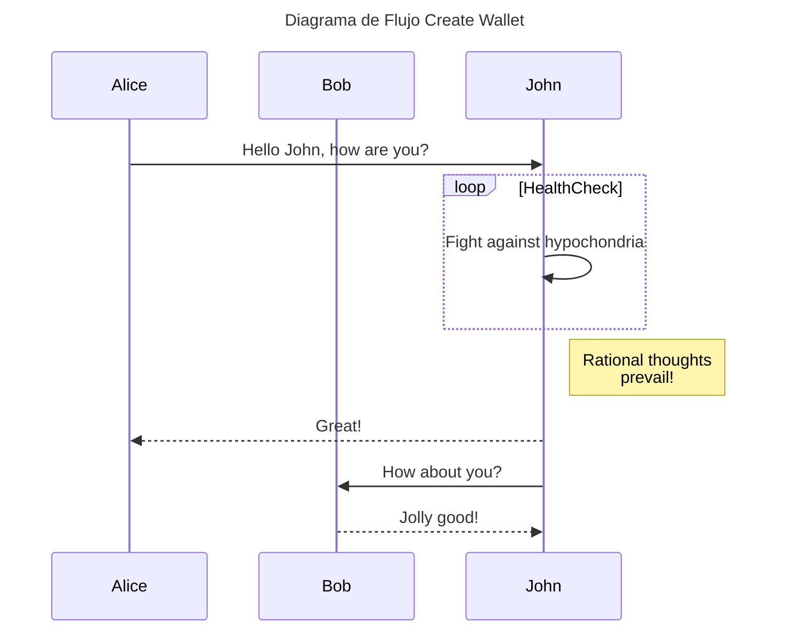
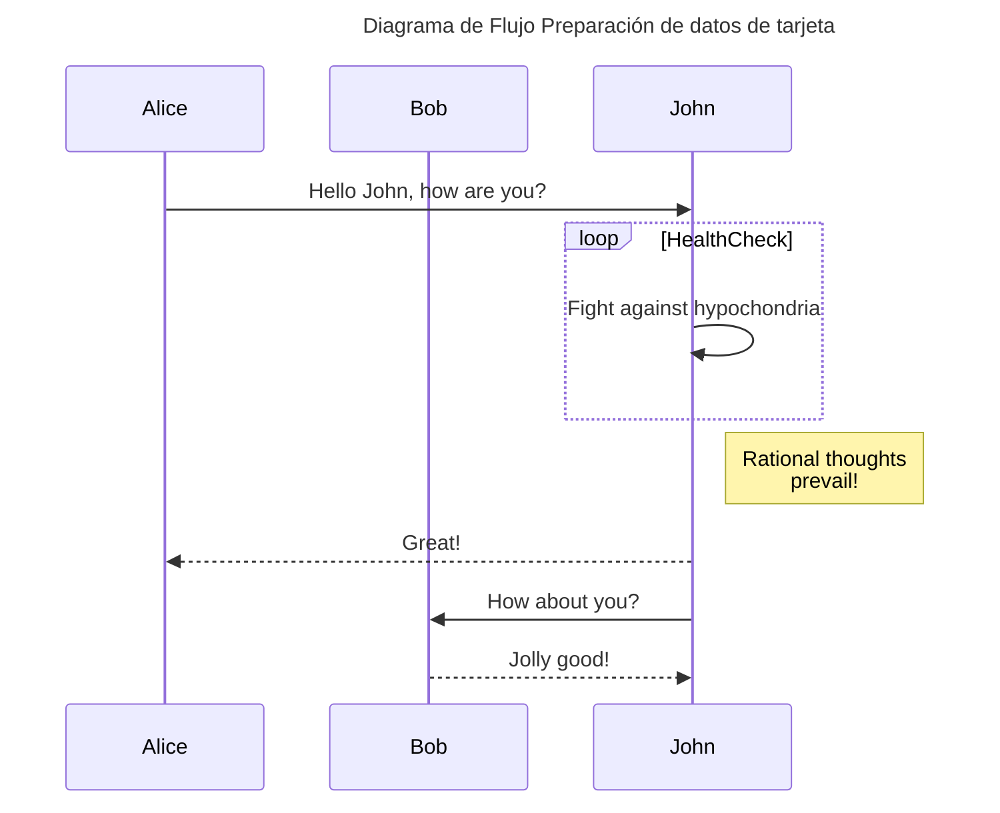

# Cucumber-JS Examples

There are so many ways you can use Cucumber-JS!

For example:

  * [a Node.js app with ESM](./examples/esm-node)
  * [a TypeScript Node.js app](./examples/typescript-node)
  * [a Command-line Node.js app](./examples/command-line)
  * [a GitHub Probot app](./examples/probot)

## Diagramas

### Mermaid with custom title/desc
